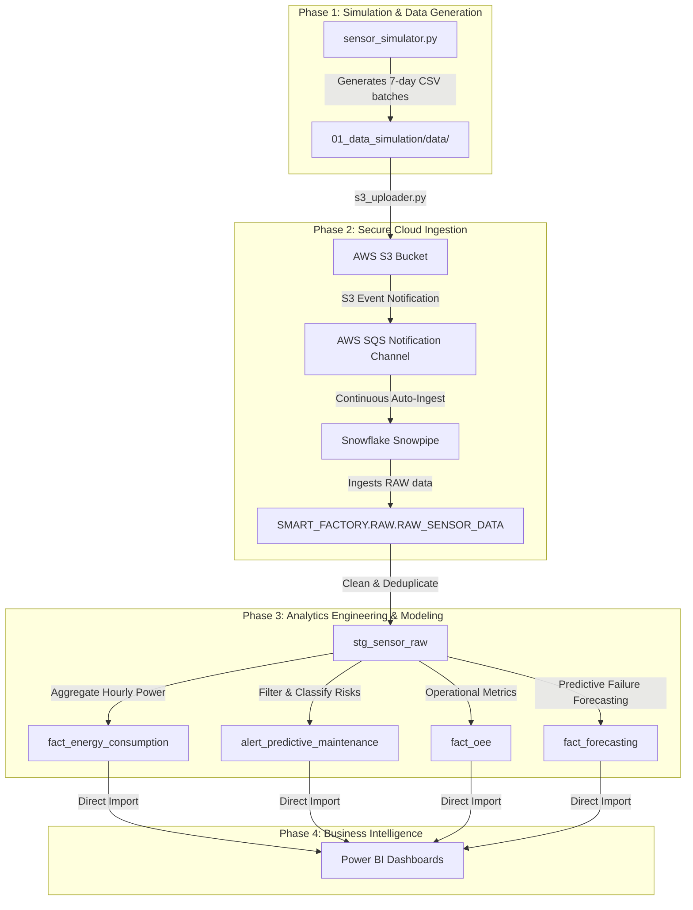

# 🏭 Smart Factory IoT & Predictive Maintenance End-to-End Pipeline

A modern, production-grade continuous data engineering pipeline simulating, ingesting, transforming, and analyzing industrial IoT sensor streams for operational efficiency and predictive maintenance.

---

## 🏗️ System Architecture

The pipeline processes high-frequency time-series data from factory floor sensors, securely transfers it to AWS cloud storage, ingests it continuously into Snowflake, transforms it using dbt Core, and delivers interactive analytics in Power BI.



---

## 📋 Project Highlights

- **Data Volume & Scale**: Processes **50,400 realistic time-series sensor records** representing 7 days of continuous operations across 5 critical industrial assets.
- **Multi-Sensor Streams**: Captures temperature (°C), vibration (mm/s), and power consumption (kW) metrics.
- **Event-Driven Auto-Ingest**: Implements continuous AWS S3-to-Snowflake streaming via event-driven **Snowpipe** with cross-account IAM role integrations.
- **Predictive Failure Forecasting**: Utilizes a 7-day linear health regression model inside dbt to forecast "Days to Failure" for degrading equipment.
- **OEE Metrics**: Computes Daily Overall Equipment Effectiveness (Availability × Performance × Quality) dynamically.

---

## 📂 Project Structure

| Directory / File | Purpose |
| :--- | :--- |
| [`01_data_simulation/`](file:///workspaces/snowflake-2/01_data_simulation) | Python-based generator configuring multi-machine degradation models. |
| ├── [`sensor_simulator.py`](file:///workspaces/snowflake-2/01_data_simulation/sensor_simulator.py) | Main simulator script creating realistic time-series sensor data batches. |
| ├── [`config.yml`](file:///workspaces/snowflake-2/01_data_simulation/config.yml) | Configuration file for simulated assets and degradation rules. |
| [`02_data_ingestion/`](file:///workspaces/snowflake-2/02_data_ingestion) | Automated AWS upload scripts & Snowflake integration scripts. |
| ├── [`s3_uploader.py`](file:///workspaces/snowflake-2/02_data_ingestion/s3_uploader.py) | Python script to batch-upload local CSVs to the target S3 bucket. |
| ├── [`fix_snowpipe.py`](file:///workspaces/snowflake-2/02_data_ingestion/fix_snowpipe.py) | Setup script to configure/recreate Snowpipe with correct column mapping. |
| ├── [`reload_snowflake.py`](file:///workspaces/snowflake-2/02_data_ingestion/reload_snowflake.py) | Full database table truncation and reload script using `COPY INTO`. |
| ├── [`phase2_config.env`](file:///workspaces/snowflake-2/02_data_ingestion/phase2_config.env) | Configuration parameters for AWS and Snowflake (ignored in Git). |
| [`03_data_transformation/`](file:///workspaces/snowflake-2/03_data_transformation) | dbt models representing staging, cleaning, and analytics marts. |
| ├── [`models/staging/`](file:///workspaces/snowflake-2/03_data_transformation/models/staging) | Staging view [`stg_sensor_raw.sql`](file:///workspaces/snowflake-2/03_data_transformation/models/staging/stg_sensor_raw.sql) cleaning and casting raw inputs. |
| ├── [`models/marts/`](file:///workspaces/snowflake-2/03_data_transformation/models/marts) | Business models: [`fact_energy_consumption.sql`](file:///workspaces/snowflake-2/03_data_transformation/models/marts/fact_energy_consumption.sql), [`alert_predictive_maintenance.sql`](file:///workspaces/snowflake-2/03_data_transformation/models/marts/alert_predictive_maintenance.sql), [`fact_oee.sql`](file:///workspaces/snowflake-2/03_data_transformation/models/marts/fact_oee.sql), and [`fact_forecasting.sql`](file:///workspaces/snowflake-2/03_data_transformation/models/marts/fact_forecasting.sql). |
| ├── [`profiles.yml`](file:///workspaces/snowflake-2/03_data_transformation/profiles.yml) | Connection details for dbt-Snowflake authentication (ignored in Git). |
| [`04_analytics/`](file:///workspaces/snowflake-2/04_analytics) | Power BI guides, analytical queries, and dataset schemas. |

---

## 🔍 Ingestion & Column Mapping Bug Resolution

> [!IMPORTANT]
> During development, a column alignment issue in the initial Snowpipe definition was detected where incoming CSV columns did not align with target Snowflake table fields.

### The Bug
The CSV column layout generated by the simulator:
`timestamp, equipment_id, type, health_score, temperature, vibration, power_consumption, is_anomaly, anomaly_reason`

The original Snowpipe configuration relied on a default positional mapping, which incorrectly loaded columns into the raw table. For example:
- `HEALTH_SCORE` (index 4) was mapped to `TEMPERATURE`.
- `TEMPERATURE` (index 5) was mapped to `VIBRATION`.
- Health score numbers (90–99%) showed up as temperature values, while energy scores were populated with low metrics, disrupting OEE metrics and alerting rules downstream.

### The Fix
We implemented [`fix_snowpipe.py`](file:///workspaces/snowflake-2/02_data_ingestion/fix_snowpipe.py), which recreates the Snowpipe with explicit, schema-aware column mapping:
```sql
CREATE OR REPLACE PIPE SMART_FACTORY.RAW.sensor_pipe
  AUTO_INGEST = TRUE
  AS
  COPY INTO SMART_FACTORY.RAW.RAW_SENSOR_DATA (
    TIMESTAMP,
    EQUIPMENT_ID,
    EQUIPMENT_TYPE,
    HEALTH_SCORE,
    TEMPERATURE,
    VIBRATION,
    POWER_CONSUMPTION,
    IS_ANOMALY,
    ANOMALY_REASON
  )
  FROM @SMART_FACTORY.RAW.sensor_stage
  FILE_FORMAT = (
    TYPE        = 'CSV'
    SKIP_HEADER = 1
    NULL_IF     = ('', 'NULL', 'null', 'NaN', 'nan')
  )
  ON_ERROR = 'SKIP_FILE';
```
This guarantees that each attribute is written into the correct column inside the raw database schema.

---

## 📊 Analytics & Transformation Models

The transformation layer in [`03_data_transformation`](file:///workspaces/snowflake-2/03_data_transformation) builds analytical aggregates to power BI dashboards:

### 1. Daily OEE Metrics (`fact_oee`)
Calculates the operational efficiency of each equipment on a daily basis:
$$\text{OEE} = \text{Availability} \times \text{Performance} \times \text{Quality}$$
- **Availability**: Percentage of time the machine was operational (not under critical anomaly).
- **Performance**: Ratio of actual throughput/work speed vs the machine's nominal speed standard.
- **Quality**: Ratio of good sensor readings vs total sensor readings (excluding anomalous fluctuations).

### 2. Predictive Failure Forecasting (`fact_forecasting`)
Predicts equipment breakdown windows in advance using a **Linear Regression Trend** on the 7-day health metrics.
- Utilizes the `SLOPE` of the health score trend:
$$\text{Health Slope} = \frac{\text{Current Health} - \text{Health 6 Days Ago}}{6.0}$$
- Estimates remaining days to failure:
$$\text{Days to Failure} = \frac{70.0 - \text{Current Health}}{\text{Health Slope}}$$
- Automatically flags an alert urgency:
  - `CRITICAL NOW` if health is already critical ($\le 70$).
  - `HIGH RISK` if expected breakdown is within 3 days.
  - `MEDIUM RISK` if expected breakdown is within 7 days.
  - `STABLE` if the health degradation slope is zero or positive.

---

## 🚀 Getting Started

### Prerequisites
- Python 3.11+
- Snowflake Account with `ACCOUNTADMIN` rights (or database creator permissions)
- AWS Account with an S3 Bucket and configured IAM Roles

---

### Step 1: Simulated Data Generation
Navigate to Phase 1 and run the generator script:
```bash
cd 01_data_simulation
pip install -r requirements.txt
python sensor_simulator.py
```
This generates the daily IoT batch CSVs inside `01_data_simulation/data/batches/`.

---

### Step 2: Configure Environment Variables
1. Rename or update the local config file [`02_data_ingestion/phase2_config.env`](file:///workspaces/snowflake-2/02_data_ingestion/phase2_config.env) with your credentials:
```env
S3_BUCKET_NAME=your-s3-bucket-name
AWS_ACCESS_KEY_ID=your-aws-access-key-id
AWS_SECRET_ACCESS_KEY=your-aws-secret-access-key
SNOWFLAKE_ACCOUNT_ID=your-snowflake-account
SNOWFLAKE_USER=your-snowflake-username
SNOWFLAKE_PASSWORD=your-snowflake-password
```

---

### Step 3: Run Ingestion & Recreate Snowpipe
Upload generated data files to AWS S3:
```bash
cd ../02_data_ingestion
python s3_uploader.py
```

Recreate the Snowflake Snowpipe with correct column mappings:
```bash
python fix_snowpipe.py
```

To perform a clean reload of all historical records:
```bash
python reload_snowflake.py
```

---

### Step 4: Run Data Transformations using dbt
Configure your local environment and build all tables/views in Snowflake:
```bash
cd ../03_data_transformation
source .venv/bin/activate
dbt run
dbt test
```
All models will execute, yielding clean staging files and prepared analytical tables (`fact_energy_consumption`, `alert_predictive_maintenance`, `fact_oee`, and `fact_forecasting`).

---

### Step 5: Connect and Load to Power BI Desktop
1. Open **Power BI Desktop**.
2. Connect to your Snowflake database using the details configured in `phase2_config.env`.
3. Use Direct Import or DirectQuery to drag the created tables from the `SMART_FACTORY.MARTS` schema to feed your interactive dashboards!
