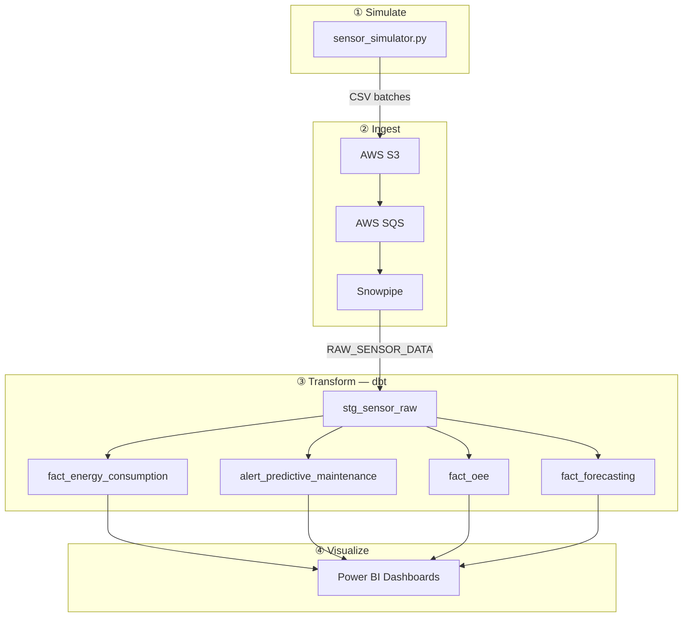

# 🏭 Smart Factory — IoT & Predictive Maintenance Pipeline

> **End-to-end data engineering pipeline** that simulates factory sensor data, streams it into Snowflake, transforms it with dbt, and surfaces insights via Power BI dashboards.

---

## 🏗️ Architecture




| Phase | Tool | What it does |
|-------|------|--------------|
| 1 · Simulate | Python | Generates 50,400 sensor readings across 5 machines over 7 days |
| 2 · Ingest | AWS S3 + Snowpipe | Event-driven auto-stream into Snowflake RAW table |
| 3 · Transform | dbt Core | Cleans raw data → builds 4 analytics mart tables |
| 4 · Visualize | Power BI Desktop | Interactive dashboards from `SMART_FACTORY.MARTS` |

---

## 📂 Project Structure

```
snowflake-2/
├── 01_data_simulation/       # sensor_simulator.py + config.yml
├── 02_data_ingestion/        # s3_uploader.py, fix_snowpipe.py, reload_snowflake.py
├── 03_data_transformation/   # dbt project (staging → marts)
│   └── models/
│       ├── staging/          # stg_sensor_raw (view)
│       └── marts/            # fact_energy_consumption, alert_predictive_maintenance
│                             # fact_oee, fact_forecasting (tables)
└── 04_analytics/             # SQL queries, Power BI guides, data dictionaries
```

---

## 📊 dbt Mart Models

| Model | Materialized | Description |
|-------|-------------|-------------|
| `stg_sensor_raw` | View | Cleans & deduplicates raw sensor records |
| `fact_energy_consumption` | Table | Hourly power usage per machine |
| `alert_predictive_maintenance` | Table | Health score alerts classified by risk level |
| `fact_oee` | Table | Daily OEE = Availability × Performance × Quality |
| `fact_forecasting` | Table | Days to failure via 7-day linear regression on health score |

**Last run:** `dbt run` → PASS=5 WARN=0 ERROR=0 · `dbt test` → PASS=6 WARN=0 ERROR=0 ✅

---

## 📈 Dashboards

### Page 1 — Energy & Operations

<!-- 📸 วางภาพ screenshot ของหน้า Energy & Operations ที่นี่ -->
> _Screenshot placeholder — Energy & Operations dashboard_

---

### Page 3 — OEE & Forecasting

<!-- 📸 วางภาพ screenshot ของหน้า OEE & Forecasting ที่นี่ -->
> _Screenshot placeholder — OEE & Forecasting dashboard_

---

## 🚀 Quick Start

**1. Generate Data**
```bash
cd 01_data_simulation
pip install -r requirements.txt
python sensor_simulator.py
# → creates CSV batches in 01_data_simulation/data/batches/
```

**2. Configure Credentials**

Fill in `02_data_ingestion/phase2_config.env`:
```env
S3_BUCKET_NAME=your-bucket
AWS_ACCESS_KEY_ID=...
AWS_SECRET_ACCESS_KEY=...
SNOWFLAKE_ACCOUNT_ID=...
SNOWFLAKE_USER=...
SNOWFLAKE_PASSWORD=...
```

**3. Upload to S3 & Setup Snowpipe**
```bash
cd 02_data_ingestion
python s3_uploader.py         # Upload CSV files to S3
python fix_snowpipe.py        # Create Snowpipe with correct column mapping
# (optional) python reload_snowflake.py  # Force full reload via COPY INTO
```

**4. Run dbt**
```bash
cd 03_data_transformation
source .venv/bin/activate
dbt run && dbt test
```

**5. Power BI** → Connect to Snowflake → `SMART_FACTORY.MARTS` → Refresh ✅

---

## 🛠️ Tech Stack

`Python 3.11` · `AWS S3` · `AWS SQS` · `Snowflake` · `Snowpipe` · `dbt Core 1.5` · `Power BI Desktop`

---

## 📝 Notes

- `phase2_config.env` and `profiles.yml` are git-ignored — never commit credentials
- A Snowpipe **column mapping bug** was discovered and fixed via [`fix_snowpipe.py`](02_data_ingestion/fix_snowpipe.py):
  original pipe had `HEALTH_SCORE` ↔ `TEMPERATURE` swapped, causing incorrect health metrics downstream
- The original [`snowflake_setup.sql`](02_data_ingestion/snowflake_setup.sql) still contains the old (wrong) column order as a historical reference

---

*Smart Factory IoT Pipeline · pubpuy · 2025*
